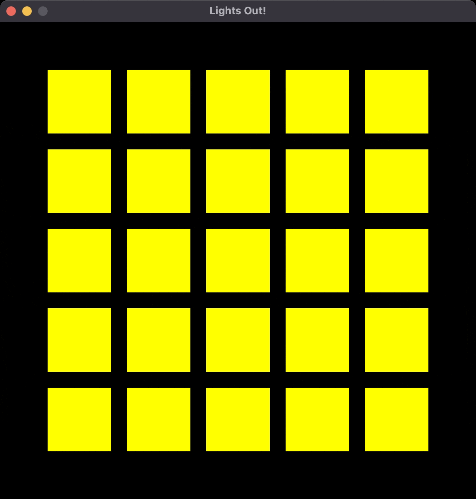
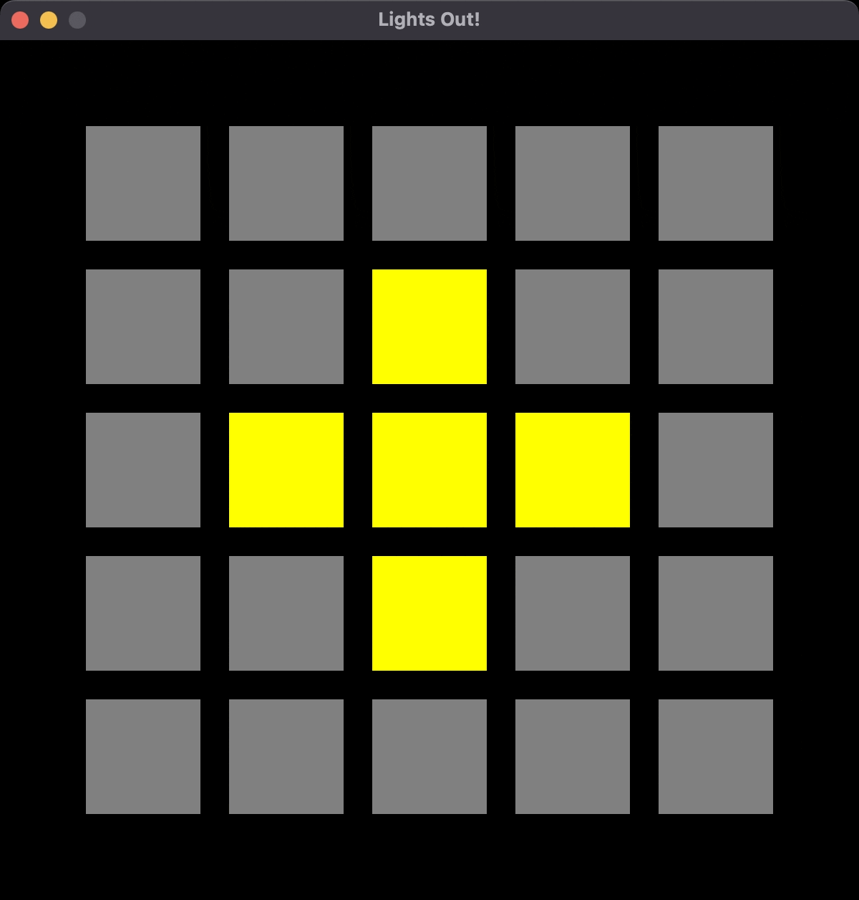

# Lights Out Game

This program will use the C++ language and C++ graphics that allows the user to play the game called Lights Out.

## Lights Out
This program is inspired by a game called Lights Out. You can play it online here: [https://www.logicgamesonline.com/lightsout/](https://www.logicgamesonline.com/lightsout/).

### Base Game
In its simplest form, the 5x5 grid of lights begins with all of the lights lit. When you click on one of the lights, it toggles itself and the (up to) four lights it borders.

Here's a gif from Lisa Dion at UVM that shows the beginning of the game, where the lights have a red outline hover effect: 

Here's another gif from Lisa Dion that shows that when you make all the lights go off, you win the game and can no longer click on the lights:

#### More Information
Currently, I have gotten the grid and boxes to show up and the boxes are clickable. My next steps are getting the boxes to stay clicked and have the neighboring boxes also go out when one is clicked.
Graphics are very challenging for me, so this project has been very difficult to work through, but so far I feel that I have gotten a lot done by myself and I am proud of where I am leaving off.

#### Cites Used
https://learn.microsoft.com/en-us/windows/win32/opengl/glmatrixmode
https://learn.microsoft.com/en-us/windows/win32/opengl/glortho